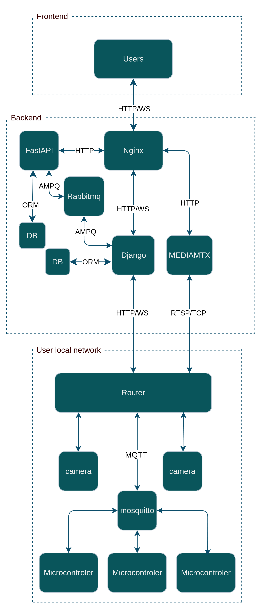

# Smart Home v2

> An advanced, fully distributed home automation application with support for multiple IoT devices, intelligent event-based automation, and asynchronous processing. Production-ready microservices architecture designed for scalability and real-time control.

##  Architecture

## Key Features
-  **Intelligent Automation** - Event-based rules engine (if-then triggers)
-  **Control IoT Devices** - Real-time device management
-  **Live Camera Streaming** - RTSP video feeds
-  **Real-time Dashboard** - Live charts & device status
-  **Async Processing** - Celery workers for background tasks
-  **Secure** - JWT auth, RBAC, encrypted communication

---

### Backend (Django + Django REST Framework)

- **Modular Architecture**: Separate Django apps for each device type (lamps, lights, buttons, cameras, temperature sensors, aquarium, sunblinds, stairs, gates, RFID)
- **Asynchronous Processing**: Celery workers + Celery Beat for scheduled tasks
- **AI Integration**: Dedicated Celery worker for ML operations (Intent Recognition, Device Classification)
- **Real-time Communication**: Django Channels integration for live WebSocket updates
- **Message Queue System**: RabbitMQ for async task distribution
- **Caching Layer**: Redis for high-performance data access
- **Relational Database**: PostgreSQL with automatic migrations
- **Device Registry**: Dynamic device registration and management
- **Event Logging**: Complete audit trail of all device interactions

### Frontend (React 18 + TypeScript)

- **Build Tool**: Vite for lightning-fast compilation and HMR
- **UI Component Library**: RSuite for professional, enterprise-grade components
- **State Management**: TanStack React Query (@tanstack/react-query) for server state + custom hooks
- **Client-side Routing**: React Router v6 with nested routes
- **Internationalization**: i18next integration for multi-language support
- **Advanced Visualization**: Recharts for interactive charts, graphs, and statistics
- **Real-time Video**: HLS.js for streaming video feeds from cameras
- **Type Safety**: Full TypeScript coverage for type-safe development

### Sensor Service (FastAPI)

- **Framework**: FastAPI - ultra-fast, async-first Python framework
- **Auto Documentation**: Auto-generated OpenAPI/Swagger UI
- **Authentication**: JWT-based token validation
- **Message Broker Integration**: RabbitMQ connectivity for event distribution
- **Async/Await**: Native async request handling

### IoT Devices (Arduino/ESP8266)

8+ device types with multiple instances:
- **Lighting Controllers**: Light and Lamp dimmers
- **Input Devices**: Wireless buttons with multi-click support
- **Environmental Sensors**: Temperature and humidity monitoring
- **Security**: RFID card readers
- **Surveillance**: Camera integration
- **Access Control**: Automatic gate openers
- **Specialized Control**: Aquarium automation and sunblind adjustment
- **Ambient Lighting**: Stair lighting automation

### Artificial Intelligence & Machine Learning

- **Fine-tuned Qwen Models**:
  - **Intent Recognition**: Natural language understanding for text commands
  - **Device Classification**: Intelligent routing of commands to appropriate devices
- **Hugging Face Integration**: Seamless loading and management of pre-trained models

### Infrastructure & DevOps

- **Containerization**: Complete Docker setup for all services
- **MQTT Protocol**: Lightweight communication between devices and broker (Mosquitto)
- **Message Broker**: RabbitMQ 3.x with built-in Management UI for monitoring
- **Reverse Proxy**: Nginx for load balancing and static file serving
- **Environment Separation**: Dedicated docker-compose files for dev and production
- **Network Routing**: Custom router service for advanced networking

---

##  Technology Stack

| Layer | Technology                    | Purpose |
|-------|-------------------------------|---------|
| **Frontend** | React 18, TypeScript, Vite    | Modern UI/UX |
| **Backend** | Django 5+, DRF, Celery        | Business Logic & API |
| **Real-time** | Django Channels, WebSocket    | Live Updates & Notifications |
| **Async Jobs** | Celery, RabbitMQ              | Background Task Processing |
| **AI/ML** | Hugging Face, Fine-tuned Qwen | Intelligent Automation |
| **IoT Gateway** | FastAPI, Uvicorn              | Sensor Data Processing |
| **Database** | PostgreSQL 13+                | Data Persistence |
| **Caching** | Redis 7.x                     | Performance Optimization |
| **Message Queue** | RabbitMQ 3.x                  | Async Communication |
| **MQTT** | Mosquitto                     | Device Communication |
| **IoT Hardware** | Arduino/ESP8266               | Device Controllers |
| **Infrastructure** | Docker, Nginx                 | Deployment & Orchestration |

---

##  Project Metrics

- **Lines of Code**: ~15,000+
- **Microservices**: 3 independent services (Backend, Sensor Service, Router)
- **Celery Workers**: 3 specialized workers (default queue, AI queue, beat scheduler)
- **IoT Device Types**: 8+ types with multiple instances per type
- **Docker Services**: 9 containerized services
- **API Endpoints**: 50+ REST endpoints with full CRUD operations
- **Database Models**: 15+ Django models with relationships

---

## Security Features

- ✅ **JWT Authentication**: Secure token-based API authentication
- ✅ **Token Validation**: Sensor Service validates all incoming requests
- ✅ **MQTT Authentication**: Broker-level device authentication
- ✅ **Environment Separation**: Sensitive configs use environment variables
- ✅ **Input Validation**: Comprehensive data validation on all endpoints
- ✅ **Secure Headers**: CORS and security headers properly configured

---

## Performance Optimizations

- **Redis Caching**: Sub-millisecond response times for frequently accessed data
- **Async Task Queue**: Long-running tasks offloaded to Celery workers
- **API Response Compression**: Gzip compression on all API endpoints
- **Frontend Code Splitting**: Lazy loading of route components
- **Real-time WebSocket**: Efficient event-driven communication for live updates
- **Connection Pooling**: Database connection pooling for optimal resource usage
## Planned Features

- **Camera Actions** - Photo capture, video recording, snapshots
- **Notifications Service** - Email and push notifications
- **Environmental Sensors** - CO₂, air quality monitoring
- **Energy Meter** - Power consumption tracking and analytics
- **Mobile Application** - React Native app for iOS/Android

> This project is actively developed and continuously improving. New features and enhancements are regularly added.

---

## License

This project is licensed under the MIT License - see the [LICENSE](LICENSE) file for details.
